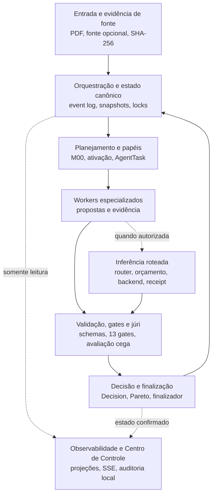
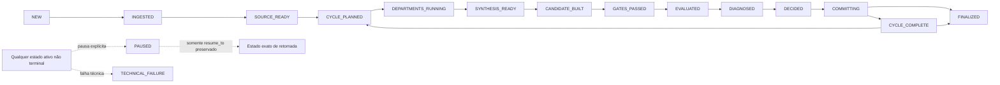
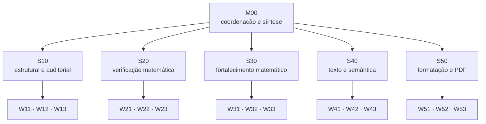
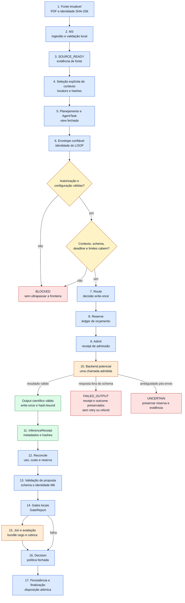
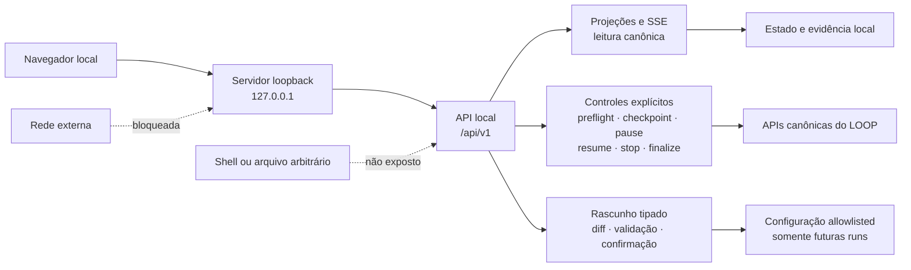

<div align="center">

# 🔬 LOOP-PRIMER
### Arquitetura auditável para revisão, refinamento e decisão sobre manuscritos científicos

[](https://github.com/Walc21/LOOP-PRIMER/actions/workflows/ci.yml)
[](https://www.python.org/)
[](LICENSE)
[-purple.svg)](docs/architecture.md)
[](docs/architecture.md#catálogo-exato-de-21-papéis)
[](docs/decisions.md)

<p align="center">
  <b>Trabalho científico especializado sob estado canônico, evidência verificável e admissão fail-closed.</b>
</p>

</div>

> **Estado estrutural:** os marcos M0–M14 estão implementados e validados
> offline dentro de seus contratos. Isso não habilita por si só modelo, Prime
> Agent, provedor, API paga ou ciclo científico real. Qualquer execução externa
> exige autorização humana nova, específica e vinculada à configuração, ao
> escopo, ao provedor, ao orçamento e à run correspondente.

## Sumário

- [Visão geral executiva](#visão-geral-executiva)
- [O que o sistema faz — e o que ele não afirma fazer](#o-que-o-sistema-faz--e-o-que-ele-não-afirma-fazer)
- [Mapa arquitetural](#mapa-arquitetural)
- [Princípios e contratos não negociáveis](#princípios-e-contratos-não-negociáveis)
- [Ciclo de vida e máquina de estados](#ciclo-de-vida-e-máquina-de-estados)
- [Agentes, departamentos e workers](#agentes-departamentos-e-workers)
- [Fluxo completo de uma tarefa](#fluxo-completo-de-uma-tarefa)
- [Fonte científica e M3](#fonte-científica-e-m3)
- [M6 e execução limitada de uma tarefa](#m6-e-execução-limitada-de-uma-tarefa)
- [Inferência roteada e envelopes confiáveis](#inferência-roteada-e-envelopes-confiáveis)
- [Estado, evidências e observabilidade](#estado-evidências-e-observabilidade)
- [Gates, avaliação, júri e decisão](#gates-avaliação-júri-e-decisão)
- [Centro de Controle local](#centro-de-controle-local)
- [Configuração e política](#configuração-e-política)
- [Operação segura](#operação-segura)
- [Estrutura do repositório](#estrutura-do-repositório)
- [Estado atual de prontidão](#estado-atual-de-prontidão)
- [Navegação para documentos internos](#navegação-para-documentos-internos)
- [Contribuição e limites para agentes](#contribuição-e-limites-para-agentes)

---

## Visão geral executiva

O **LOOP-PRIMER** é um sistema arquitetural para organizar revisão, refinamento,
avaliação e decisão sobre manuscritos científicos — com ênfase atual em fontes
LaTeX e PDF — de forma local, reproduzível e auditável. Ele trata o trabalho
científico como uma sequência de propostas especializadas submetidas a
contratos de identidade, proveniência, estado, orçamento, validação e decisão.

O problema central não é apenas “obter uma resposta de um modelo”. É impedir
que uma resposta não rastreável se torne, por acidente, estado científico. Para
isso, o sistema separa três responsabilidades:

1. **Papéis especializados propõem conteúdo e evidência.** M00 coordena e
   sintetiza; departamentos e workers recebem tarefas fechadas e produzem
   propostas estruturadas.
2. **O LOOP controla o protocolo.** Identidade de run, ciclo, papel, política,
   orçamento, hashes, receipts, transições e decisões são derivados ou
   validados localmente; não são delegados ao modelo.
3. **Componentes canônicos aplicam efeitos.** Apenas merge, gates, política e
   finalizador, em suas fases próprias, podem construir challenger, validar,
   decidir destino e publicar uma disposição.

Essa separação permite testar a arquitetura sem chamar um modelo e permite, sob
autorização específica, admitir uma inferência limitada sem converter o backend
em autoridade do sistema. Uma arquitetura pronta e uma suíte offline aprovada
demonstram contratos e comportamento estrutural; não demonstram que um artigo
real foi melhorado, que um modelo está disponível ou que uma conclusão
científica é verdadeira.

No vocabulário dos contratos públicos, M10 publica uma **canonical, content-addressed `Decision`**;
as **M10 CLIs are operational** somente dentro das fronteiras fail-closed documentadas.

## O que o sistema faz — e o que ele não afirma fazer

| Tema | O que o sistema suporta estruturalmente | O que não deve ser inferido |
|---|---|---|
| Ingestão e preservação | Identificação por SHA-256, congelamento do PDF, inspeção conservadora de fonte opcional e derivados separados. | Que extração, OCR, reconstrução ou compilação provam equivalência matemática com o original. |
| Validação determinística | Schemas fechados, invariantes de estado, contenção de paths, hashes e gates locais versionados. | Que um gate prova qualquer propriedade além de seu verificador. |
| Papéis especializados | Topologia fixa de 21 papéis, tarefas focais, ativação esparsa e propostas estruturadas. | Que um agente pode alterar champion, decidir promoção ou ampliar sua própria autoridade. |
| Execução roteada | Registry, router, admissão, backend limitado, output durável, receipt e reconciliação. | Que existe target ativo, ou que disponibilidade, autorização ou confiabilidade de um modelo já foram demonstradas. |
| Orçamento | Reserva anterior ao consumo, limites em múltiplos níveis, reconciliação e preservação de `UNCERTAIN`. | Que falha, timeout ou ambiguidade devolvem saldo, autorizam retry ou escolhem fallback automaticamente. |
| Gates e júri | Treze gates M7, comparação cega, rubrica versionada, meta-review e veto matemático. | Que pontuação ou consenso substituem avaliação humana ou certificam verdade científica geral. |
| Decisão e Pareto | Política fechada, `Decision` content-addressed, relação Pareto e finalização transacional. | Que o modelo escolhe livremente a ação ou que Pareto equivale a “melhor artigo” em sentido absoluto. |
| Centro de Controle | Projeções locais, SSE, controles canônicos e editor tipado allowlisted. | Que a interface expõe shell, executa ação arbitrária ou habilita inferência ao ser aberta. |
| Execução científica real | Infraestrutura de admissão e contenção potencialmente utilizável sob condições explícitas. | Que execução live está globalmente pronta, habilitada, concluída ou aprovada. |
| Qualidade científica | Evidência estruturada, revisão por dimensões e rastreabilidade de decisões. | Que há garantia de correção, qualidade, novidade, publicação ou aceitação por pares. |

## Mapa arquitetural

O desenho é contract-first: camadas inferiores preservam fonte e estado;
camadas intermediárias organizam trabalho e, quando autorizado, inferência;
camadas superiores validam, decidem e publicam efeitos. Observabilidade projeta
evidência já confirmada, sem se tornar uma segunda fonte de verdade.



### Camadas e responsabilidades

| Camada | Responsabilidade canônica | Principais contratos |
|---|---|---|
| Entrada e fonte | Congelar a entrada, registrar identidade e produzir derivados verificáveis. | `input/inbox/`, M3, `SOURCE_READY`, manifests e SHA-256. |
| Estado durável | Aceitar somente transições válidas e conservar histórico recuperável. | Event log encadeado, snapshots derivados, locks e idempotência. |
| Planejamento | Selecionar escopo, modo e dependências sem executar trabalho especulativo. | Blackboard, grafo de impacto, view fechada e `AgentTask`. |
| Organização de papéis | Distribuir análise entre M00, cinco departamentos e quinze workers. | Catálogo versionado em `config/roles/` e profundidade máxima 2. |
| Execução | Admitir uma fronteira consumidora apenas após rota, orçamento e contexto válidos. | M6, M12, M12.5, M12.5.1, output e `InferenceReceipt`. |
| Síntese e validação | Consolidar propostas, construir challenger imutável e testar propriedades programadas. | `DepartmentPacket`, merge isolado, `GateReport` e schemas. |
| Avaliação e diagnóstico | Comparar candidatos cegamente, aplicar rubrica e classificar evolução. | `JuryVerdict`, meta-veredito, avaliação e diagnóstico. |
| Decisão e disposição | Escolher ação por política fechada e aplicá-la sem mudar conteúdo avaliado. | `Decision`, finalizador, champion, Pareto e rejected. |
| Observabilidade e controle | Projetar estado, orçamento e erros; solicitar apenas operações canônicas. | Status, logs allowlisted, SSE e ledger separado da Central. |

## Princípios e contratos não negociáveis

### 1. Imutabilidade e identidade de conteúdo

- O PDF de entrada é identificado por SHA-256 e preservado sem anotação,
  recompressão, substituição ou sobrescrita.
- Fonte aceita, extração, reconstrução, renderização, challenger e relatórios
  são derivados distintos, em paths e manifests próprios.
- Publicações anteriores não são corrigidas “no lugar”. Uma nova tentativa ou
  versão recebe identidade e raiz próprias.
- Conteúdo avaliado não pode mudar entre júri e finalização sem nova avaliação.

### 2. Evidência e contenção

- Locators e paths precisam permanecer sob raízes autorizadas; traversal,
  arquivo especial e symlink são rejeitados nas fronteiras aplicáveis.
- Eventos, tarefas, propostas, outputs, manifests, gates, decisões e receipts
  carregam identidades e hashes que precisam corresponder aos bytes locais.
- Ausência ou ambiguidade de evidência não é preenchida por aproximação,
  posição, OCR implícito, semântica provável ou conteúdo inventado.
- A evidência operacional pode ser auditada; ela não amplia o contrato nem a
  autoridade de quem a produziu.

### 3. Durabilidade

Publicações duráveis seguem a sequência **staging → `fsync` do arquivo/árvore
→ `os.replace` → `fsync` do diretório-pai**. Locks, idempotência e comparação de
hash evitam duas verdades concorrentes. Falhas reais de I/O propagam; somente
incompatibilidades de `fsync` de diretório explicitamente documentadas para a
plataforma podem ser toleradas.

### 4. Separação de autoridade

- Papéis produzem propostas e evidência; somente o merge canônico escreve o
  challenger.
- Nenhum agente escreve diretamente no champion.
- O modelo não determina identidade de protocolo. Seu domínio, quando houver
  inferência, é o payload científico permitido pelo schema projetado.
- O LOOP deriva run, ciclo, papel, base, versão de prompt e demais campos
  confiáveis; política e finalizador determinam e aplicam a disposição.

### 5. Fail-closed

Contexto excessivo, hash divergente, estado incompatível, schema inválido,
autorização ausente ou expirada, orçamento insuficiente, arquivo inseguro e
evidência incompleta bloqueiam a ação. O sistema não usa “melhor esforço” para
atravessar uma fronteira contratual e não converte falha técnica em sucesso
científico.

### 6. Orçamento e ordem de inferência

A ordem canônica da fronteira consumidora é:

```text
route → reserve → admit → backend → receipt → reconcile → stop
```

Seleção e materialização de contexto, validação de schema e preflight precisam
passar antes dessa cadeia; overflow determinístico é recusado antes de routing,
orçamento e backend. Um resultado conhecido e válido pode ser publicado como
output write-once antes do receipt. Se o pedido pode ter sido enviado, mas não
há receipt suficiente para provar o resultado, a reserva permanece
`UNCERTAIN`: não há retry, fallback, release ou refund implícitos.

### 7. Dublês de teste

Componentes com `is_test_double=True` são identificados como dublês e falham
fechados fora de testes. Seu uso exige `allow_test_doubles=True` estritamente
booleano na API de teste; JSON persistido e CLIs operacionais não expõem esse
bypass. Um dublê prova o contrato estrutural exercitado, não disponibilidade ou
qualidade de um backend real.

## Ciclo de vida e máquina de estados

Os estados são uma enumeração fechada em `config/system.yaml`, e as transições
são validadas pela máquina de estados. O caminho progressivo principal é:



O diagrama mostra as grandes fases, não autoriza saltos. `PAUSED` conserva um
único `resume_to` e não pode contornar a sequência. `FINALIZED` e
`TECHNICAL_FAILURE` são terminais. Depois de `CYCLE_COMPLETE`, o sistema pode
planejar outro ciclo ou finalizar; `COMMITTING` também pode chegar a
`FINALIZED` quando o pacote terminal foi integralmente revalidado.

| Fase | Estados | Significado |
|---|---|---|
| Preparação da fonte | `NEW`, `INGESTED`, `SOURCE_READY` | A entrada existe, o original foi preservado e as evidências locais requeridas passaram. |
| Planejamento | `CYCLE_PLANNED` | Agenda, tarefas, views e ativação foram fixadas para o ciclo. |
| Trabalho departamental | `DEPARTMENTS_RUNNING`, `SYNTHESIS_READY` | Papéis produzem e consolidam propostas; receipts determinam o que foi recebido. |
| Candidatura e gates | `CANDIDATE_BUILT`, `GATES_PASSED` | O merge publicou challenger imutável e os gates obrigatórios passaram. |
| Avaliação e diagnóstico | `EVALUATED`, `DIAGNOSED` | Júri/meta-review foram validados e a evolução foi classificada. |
| Decisão e persistência | `DECIDED`, `COMMITTING`, `CYCLE_COMPLETE` | Política publicou a ação e o finalizador aplicou a disposição. |
| Controle e encerramento | `PAUSED`, `FINALIZED`, `TECHNICAL_FAILURE` | Progressão suspensa, encerrada com pacote válido ou abortada tecnicamente. |

### Ações canônicas de decisão

As ações são valores fechados de política — não comandos livres de um modelo:

| Ação | Efeito pretendido |
|---|---|
| `PROMOTE` | Publicar como nova versão histórica do champion um challenger já avaliado e aprovado. |
| `ARCHIVE_PARETO` | Preservar um trade-off não dominado, com relação Pareto revalidada. |
| `REJECT` | Preservar a referência do challenger sem promovê-lo. |
| `REFOCUS_AND_CONTINUE` | Produzir refoco reversível para o próximo ciclo a partir de diagnóstico permitido. |
| `CONTINUE_UNCHANGED` | Planejar continuidade sem alterar a estratégia por refoco. |
| `REQUEST_EXTRA_JUDGMENT` | Solicitar julgamento adicional dentro do limite persistido. |
| `PAUSE` | Suspender progressão conservando estado e reservas relevantes. |
| `FINALIZE` | Encerrar somente com pacote final e gates finais vinculados. |
| `ABORT_TECHNICAL` | Registrar encerramento técnico sem alegar conclusão científica. |

## Agentes, departamentos e workers

A topologia lógica é fixa: **1 gerente + 5 departamentos + 15 workers**. Ela
organiza responsabilidade, não concede acesso direto ao estado canônico.



M00 opera em `RUN`. Os demais papéis podem receber `RUN`, `CHECK`, `SHIFT` ou
`FREEZE`: executar, revisar evidência existente, explorar alternativa limitada
motivada por diagnóstico, ou permanecer inativo. No primeiro ciclo auditável,
os cinco departamentos participam; depois, o grafo de impacto governa ativação
esparsa. `FREEZE` não gera chamada, subagente ou trabalho especulativo.

| ID | Camada | Responsabilidade | Limites de autoridade | Produto ou evidência esperada |
|---|---|---|---|---|
| `M00` | Coordenação | Planejar ciclos, sintetizar propostas e aplicar decisões canônicas. | Produz propostas; não escreve champion nem challenger diretamente. | Agenda, síntese gerencial e decisão submetida à política canônica. |
| `S10` | Departamento estrutural/auditorial | Consolidar a auditoria estrutural. | Consolida; não promove, finaliza ou altera estado por conta própria. | `DepartmentPacket` estrutural com propostas aceitas e evidência. |
| `W11` | Worker estrutural | Propor correções de resumo e introdução. | Proposta apenas; escopo e base vêm da `AgentTask`. | `AgentProposal` com locators e operações verificáveis. |
| `W12` | Worker estrutural | Propor correções de organização e dependências lógicas. | Proposta apenas; não escreve o manuscrito canônico. | `AgentProposal` sobre arquitetura lógica. |
| `W13` | Worker estrutural | Propor correções de contribuições e conclusão. | Proposta apenas; não decide suficiência científica. | `AgentProposal` sobre contribuições e conclusão. |
| `S20` | Departamento de verificação | Consolidar validação técnica e matemática. | Revisa dependências técnicas; não substitui gates ou júri. | `DepartmentPacket` de verificação matemática. |
| `W21` | Worker de verificação | Verificar definições, notação e hipóteses. | Registra achados; não declara correção global. | `AgentProposal` e locators para definições e hipóteses. |
| `W22` | Worker de verificação | Verificar teoremas, lemas e provas. | Não promove; seu gate final é só uma parte do pacote `FINALIZE`. | `AgentProposal`; `FinalGateReport` matemático quando exigido. |
| `W23` | Worker de verificação | Verificar cálculos e reprodutibilidade. | Não executa disposição ou altera evidência histórica. | `AgentProposal` sobre cálculos e reprodutibilidade. |
| `S30` | Departamento de fortalecimento | Consolidar propostas de fortalecimento matemático. | Mudanças matemáticas retornam a S20 antes de síntese ou merge. | `DepartmentPacket` de fortalecimento. |
| `W31` | Worker de fortalecimento | Propor melhorias de enunciados e constantes. | Proposta condicionada à verificação posterior. | `AgentProposal` para enunciados e constantes. |
| `W32` | Worker de fortalecimento | Propor generalizações justificadas. | Não amplia hipóteses ou conclusões sem evidência e revisão. | `AgentProposal` de generalização. |
| `W33` | Worker de fortalecimento | Propor aplicações e exemplos. | Não transforma exemplo em prova ou decisão. | `AgentProposal` para aplicações e exemplos. |
| `S40` | Departamento textual/semântico | Consolidar propostas textuais e semânticas. | Possível efeito técnico retorna a S20 antes de síntese ou merge. | `DepartmentPacket` textual/semântico. |
| `W41` | Worker textual | Propor correções linguísticas. | Não altera significado técnico sem revisão correspondente. | `AgentProposal` linguística. |
| `W42` | Worker semântico | Propor precisão de significado e escopo. | Não decide validade da afirmação científica. | `AgentProposal` de precisão semântica. |
| `W43` | Worker textual | Propor coesão e estilo acadêmico. | Estilo não compensa falha matemática. | `AgentProposal` de coesão e estilo. |
| `S50` | Departamento de formatação/PDF | Consolidar conformidade de apresentação sem alterar semântica. | Necessidade semântica volta a M00 e ao departamento responsável. | `DepartmentPacket` de formatação/PDF. |
| `W51` | Worker de formatação | Propor correções de LaTeX e referências. | Não altera conteúdo avaliado na finalização. | `AgentProposal`; `FinalGateReport` de integridade quando exigido. |
| `W52` | Worker de formatação | Propor correções de equações, figuras e tabelas. | Atua na apresentação; não decide validade matemática. | `AgentProposal` de apresentação matemática. |
| `W53` | Worker de conformidade | Verificar conformidade do PDF final. | O relatório atesta verificações programadas, não qualidade científica geral. | `AgentProposal`; `FinalGateReport` de PDF quando exigido. |

Workers são folhas: não existe recursão autônoma ilimitada. Em uma sessão Prime
Agent especificamente autorizada, a raiz deve aplicar `/rlm-max-depth 2` apenas
naquela sessão, sem `--global`: M00 está na profundidade 0, departamentos na 1
e workers na 2. Mesmo nessa configuração, workers não decidem promoção ou
finalização; decisão e efeito continuam sujeitos a schemas, gates, política,
locks e finalizador.

## Fluxo completo de uma tarefa

O fluxo abaixo distingue preparação determinística, fronteiras de autorização,
inferência potencial, bloqueios e evidência. Nem toda tarefa precisa chamar um
modelo: execução offline e papéis congelados percorrem apenas as partes
aplicáveis.



No diagrama, azul indica processamento local determinístico; amarelo,
fronteiras de autorização/admissão; laranja, inferência potencial; verde,
evidência durável; e vermelho, parada conservadora.

Uma falha em gates não é apagada: ela pode alimentar uma `Decision` de rejeição
ou checkpoint permitido. Júri só ocorre depois dos gates requeridos; decisão só
opera sobre evidência publicada; finalização não recompõe nem “melhora” o
challenger já avaliado.

## Fonte científica e M3

M3 transforma uma entrada não confiável em uma base local rastreável sem
alterar o original:

1. aceita o PDF canônico em `input/inbox/artigo.pdf`, recusa entrada insegura e
   congela seus bytes;
2. registra tamanho, SHA-256 e modo de fonte em `INGESTED` antes das
   transformações subsequentes;
3. inspeciona `source.zip`, quando presente, sem extração insegura; uma fonte
   LaTeX só é preferida se cumprir o contrato estrutural;
4. publica separadamente árvores de original, extração e renderização, cada uma
   com manifest e hash;
5. calcula o gate `SOURCE_READY` a partir de limites versionados de tamanho,
   páginas, cobertura textual, equações, referências e amostra visual;
6. só então disponibiliza o baseline editável e a evidência para planejamento.

`SOURCE_READY` significa **prontidão rastreável da fonte para as etapas
seguintes**. Não significa que o manuscrito está correto, que a reconstrução é
matematicamente equivalente ou que uma melhoria foi aprovada.

No modo `PDF_ONLY_RECONSTRUCTION`, `normalized.json` preserva a transcrição
textual canônica usada pela evidência M3. `reconstructed.tex` é uma
representação auxiliar, sanitizada e compilável quando possível; não substitui
a transcrição. Uma reconstrução ou diagnóstico corretivo recebe artefato
separado e create-only. Falha de compilação permanece fail-closed em `INGESTED`
e não autoriza reescrever uma tentativa congelada, escolher outro PDF ou
iniciar inferência.

## M6 e execução limitada de uma tarefa

M6 define a orquestração hierárquica por tarefas, workspaces, handles e receipts.
Sua superfície oficial de smoke controlado prepara uma prova operacional mínima
do caminho routed, sem iniciar o ciclo completo:

- aceita no máximo uma `AgentTask`, restrita a `S10` ou `W11`;
- fixa uma chamada, uma unidade concorrente, zero retry, zero fallback, um
  ciclo, custo máximo zero, `deny_remote` e target único;
- aceita somente endpoint HTTP com host textual literal `127.0.0.1`, porta
  explícita e path exato `/v1/chat/completions`, caso uma execução local seja
  autorizada;
- exige seleção M3 explícita, estrutural, hash-bound e create-only; não escolhe
  páginas, não trunca e não usa fallback semântico;
- materializa task, view, prompt, wrapper, schema, saída reservada e overhead
  antes de criar uma tentativa;
- executa preflight antes de attempt, route, ledger, reserva ou backend;
- revalida M3 e a seleção imediatamente antes da fronteira consumidora;
- para depois do outcome da tarefa, sem M7, síntese, júri, novo ciclo ou
  continuação automática.

O comando é inerte por padrão: sem os dois consentimentos booleanos da
invocação corrente, responde `DISABLED` e não cria tentativa. Uma autorização
anterior, configuração persistida ou variável de ambiente não é consentimento
reutilizável. Overflow de contexto resulta em `BLOCKED` antes de efeitos; erro
ambíguo depois do envio resulta em `UNCERTAIN`, preservado sem repetição,
sobrescrita, fallback ou refund.

O dialeto estruturado OpenAI-compatible aceito nessa superfície é um contrato
de compatibilidade do envelope e do path; não é prova de que um modelo obedecerá
ao schema. A resposta ainda precisa passar pelo parser, pelo schema científico
fechado e pela composição confiável do LOOP. M6 é infraestrutura de admissão e
contenção, não um loop científico contínuo ou globalmente habilitado.

## Inferência roteada e envelopes confiáveis

### Da tarefa à proposta

`AgentTask` é o pedido canônico: vincula run, ciclo, papel, modo de ativação,
base SHA-256, escopo, locators de entrada, schema de saída, versão de prompt e
restrições. Para workers, o schema de saída é `agent-proposal.schema.json`; para
subgerentes, `department-packet.schema.json`.

Quando há inferência routed autorizada, o modelo recebe apenas contexto
materializado e o contrato científico necessário. Ele produz o **payload
científico** de uma proposta: escopo, evidência, operações, claims afetados,
dependências, risco, confiança e validações solicitadas. Campos de protocolo são
proibidos nesse payload.

O LOOP então:

1. valida o payload pelo schema científico projetado;
2. deriva da `AgentTask` o envelope confiável — versão, `proposal_id`,
   `role_id`, `cycle_id`, `base_hash` e `prompt_version`;
3. compõe `AgentProposal` sem permitir sobreposição entre payload e identidade;
4. revalida a proposta completa pelo schema canônico e pela identidade M6;
5. publica output e manifest write-once, emite receipt e reconcilia a reserva;
6. entrega os mesmos bytes validados ao workspace do orquestrador.

Assim, o modelo não controla `run_id`, papel, política, orçamento, rota,
provider, decisão, identidade confiável ou disposição. Para jurados routed, a
mesma separação distingue `actor_id` do avaliador e `routing_role_id` usado
somente para selecionar política e contabilização; avaliadores não criam novos
papéis na topologia de 21 IDs.

### Routing, backend e recuperação

`ModelRegistry` valida targets e rotas versionados; `ModelRouter` escolhe uma
rota deterministicamente a partir do papel efetivo, capacidades, privacidade,
limites e independência; `InferenceRuntime` é o único componente que une rota,
ledger, backend, output, receipt e reconciliação.

Decisões de rota e receipts são metadados write-once vinculados por hash. Eles
não armazenam artigo integral, prompt completo, contexto materializado,
mensagem privada ou credencial. Se um receipt existente corresponde à mesma
requisição, a recuperação reconcilia esse receipt em vez de chamar novamente o
backend. Escalada, quando permitida, exige reason code fechado, limite e nova
decisão persistida; não é retry silencioso.

## Estado, evidências e observabilidade

O estado científico pertence ao repositório, não à sessão de um modelo ou do
Prime Agent. Os principais registros são:

- **event log:** eventos append-only, sequenciais, com `previous_event_hash`,
  `event_hash`, transição, ator, payload limitado e hashes de artefatos;
- **snapshots:** projeções derivadas do log, úteis para consulta, nunca
  substitutos dos eventos autoritativos;
- **receipts M6 e de inferência:** provam admissão, identidade, rota, resultado
  conhecido e vínculo com output sem registrar o conteúdo integral;
- **ledger de orçamento:** conserva autorização, reserva, admissão,
  reconciliação, alertas, progresso e `UNCERTAIN` por run;
- **artefatos científicos:** fonte, challenger, gate report, avaliação,
  diagnóstico, decisão e receipt final ligados por hashes;
- **logs estruturados:** somente campos operacionais allowlisted, com rotação e
  cadeia de hash; segredos e conteúdo científico integral ficam fora.

Observabilidade informa uso confirmado, reservado e comprometido, saldo por
limite, deadlines, chamadas, concorrência, alertas, estado, diagnóstico,
próxima ação e nível de assurance. Ela não inventa eventos ainda não
persistidos e não transforma uma visão derivada em prova científica.

## Gates, avaliação, júri e decisão

### Gates

M7 executa um conjunto ordenado de treze verificadores locais:

`contracts_state`, `source_provenance`, `latex_compile_safe`, `render`,
`pdf_valid`, `references_labels`, `asset_inventory`, `claim_dependencies`,
`math_critical_issues`, `forbidden_metatext`, `local_budget`,
`manifest_integrity` e `correctness_math`.

Cada resultado registra versão do verificador, hashes de entrada antes/depois,
exit code, duração, classificação, saída limitada e locators de evidência.
Gates não chamam modelo ou rede. `correctness_math` é duro e não pode ser
compensado por clareza, estilo ou contribuição. Ainda assim, “passou” significa
somente que as condições programadas daquele verificador foram satisfeitas.

### Júri e rubrica

Depois dos gates requeridos, M8 apresenta exatamente dois candidatos sob IDs
neutros em ordens A/B e B/A. Metadados de autoria, ordem de criação e condição
de champion são removidos; inconsistência posicional, divergência e veto são
evidências explícitas. A rubrica versionada possui oito dimensões:

- `correctness_math`;
- `proof_completeness`;
- `logical_coherence`;
- `scientific_contribution`;
- `semantic_precision`;
- `clarity`;
- `format_integrity`;
- `reproducibility`.

Vereditos são consolidados por meta-review antes de `EVALUATED`. O júri avalia
evidência observável e não solicita cadeia privada de raciocínio.

### Diagnóstico, Pareto, decisão e STOP

M9 classifica progresso, plateau, oscilação, regressão ou inconclusão e pode
produzir refoco reversível. M10 revalida as evidências M7–M9 e consulta uma
tabela fechada para publicar uma única `Decision`. `ARCHIVE_PARETO` compara as
oito dimensões sob o gate matemático e preserva referências históricas, mesmo
quando dominadas depois.

O finalizador é o único escritor de disposição. Sob lock, ele revalida
`Decision`, candidato, gates, avaliação, diagnóstico e relação Pareto, registra
`COMMITTING` e aplica o efeito sem modificar o conteúdo. `FINALIZE` exige ainda
o pacote final hash-bound com relatórios de W22, W51 e W53 vinculados ao mesmo
manifest, PDF renderizado e relatório final.

`control/STOP` e os controles canônicos impedem novas admissões ou mutações
conforme a fase; não apagam reservas, receipts ou evidência. STOP não autoriza
editar JSONL manualmente, reembolsar `UNCERTAIN` ou pular para uma decisão.

## Centro de Controle local

O Centro de Controle M14 é uma interface de observabilidade e solicitação de
controles sobre as fontes canônicas existentes. O caminho oficial é:

```bash
bash bin/start-control-center.sh
```

Depois, abra [http://127.0.0.1:8765](http://127.0.0.1:8765) no mesmo computador.
O launcher fixa o bind em `127.0.0.1`, valida a raiz e inicia somente o servidor
project-local. Abrir os assets com `file://` não é suportado: faltariam a origem
HTTP, `/assets/` e a API `/api/v1`.



GETs projetam snapshots, journals, orçamento, erros e metadados de artefatos sem
efeitos colaterais. SSE usa cursor derivado de fontes duráveis, backfill e
deduplicação; queda do stream recua para polling somente leitura. A interface
não oferece download por path, shell, `bootstrap`, `run_cycle`, backend,
inferência ou adaptador arbitrário.

POSTs canônicos verificam same-origin, confirmação, `Idempotency-Key`,
hash/versão esperados e pré-condições; os resultados entram em um ledger de
auditoria separado e hash-encadeado. Repetir a mesma chave devolve o mesmo
resultado em vez de reaplicar o efeito.

O editor não aceita YAML livre. Ele expõe apenas campos tipados e allowlisted,
gera diff e validação cruzada, vincula o rascunho ao hash-base e publica por
staging e rename atômico. A aplicação é bloqueada enquanto houver run não
terminal e só afeta runs futuras. Configurar `enabled: true` não equivale a
autorizar modelo: provider, política de conteúdo, orçamento, preflight e
autorização hash-bound continuam obrigatórios.

## Configuração e política

| Grupo | Função |
|---|---|
| `config/system.yaml` | Catálogo fechado de estados, ações, modos, pipeline e autoridade de escrita. |
| `config/gates.yaml` | Limites de `SOURCE_READY`, gates prévios e conjunto ordenado de treze gates M7. |
| `config/decision-policy.yaml` | Precedência, mapeamento de classificações, limites e papéis exigidos para finalização. |
| `config/budgets.yaml` | Defaults de execução, privacidade, orçamento, observabilidade, targets e routing. |
| `config/roles/*.yaml` | Topologia, responsabilidade, parent/children, profundidade e modos de cada papel. |
| `config/rubrics/evaluation.yaml` | Escala, dimensões, thresholds e natureza compensável ou dura. |
| `config/schemas/*.json` | Formas fechadas e invariantes de tarefas, propostas, eventos, reports, receipts e decisões. |

Configuração é versionada e validada estrutural e cruzadamente. Durante uma
run, limites e política vinculados não podem ser trocados para ampliar
autoridade; alterações são destinadas a uma nova run e exigem nova autorização
quando envolvem execução. Endpoint local, nome de modelo, target, rota ou perfil
de orçamento são apenas dados de configuração — não prova de disponibilidade e
não habilitação automática.

Os defaults globais são deliberadamente conservadores: execução, modelos,
targets locais/remotos, APIs pagas e perfis de orçamento permanecem
desabilitados até configuração e consentimento explícitos.

## Operação segura

### Validação offline

```bash
bin/check.sh
```

Esse check local valida superfícies canônicas, configuração, topologia,
profundidade, orçamento, observabilidade e defaults fail-closed. Ele não inicia
modelo, Ollama, Prime Agent, endpoint, API paga ou ciclo científico.

### Centro de Controle

```bash
bash bin/start-control-center.sh
```

Esse comando inicia somente a interface loopback descrita acima. A existência
do servidor e da UI não muda `live_ready`, não registra autorização de run e
não chama backend.

Para inspeção segura:

- prefira checks, status e projeções somente leitura;
- preserve `control/STOP`, roots de tentativa e reservas `UNCERTAIN`;
- não edite eventos, snapshots, manifests, receipts, ledgers ou pointers à mão;
- não trate arquivos em `runtime/` como configuração ou código atual;
- consulte o [runbook](docs/runbook.md) antes de qualquer operação além das
  duas entradas acima;
- não invente um comando live. Execução científica requer decisão humana nova
  e um procedimento explicitamente delimitado.

## Estrutura do repositório

```text
LOOP-PRIMER/
├── .github/                         # CI e metadados de colaboração
├── .prime/
│   └── agent/
│       ├── prompts/                 # Templates project-local descobríveis
│       └── skills/article-loop/     # Pacote Python e interface Prime isolada
├── bin/                             # Entradas shell locais e fail-closed
├── config/
│   ├── roles/                       # Catálogo exato de 21 papéis
│   ├── rubrics/                     # Rubrica de avaliação
│   └── schemas/                     # JSON Schemas canônicos
├── control/                         # Testes contratuais e de marcos
├── docs/                            # Arquitetura, ADRs, contratos e runbooks
├── input/inbox/                     # Entrada canônica, tratada como não confiável
├── artifacts/                       # Original e derivados content-addressed
├── prompts/                         # Núcleos imutáveis, overlays e registry
├── scripts/                         # CLIs e componentes canônicos por marco
├── state/                           # Eventos, snapshots, locks, ledgers e decisões
├── versions/                        # Champion, challengers, Pareto e rejected
├── workspaces/                      # Merge e trabalho isolado por execução
├── reports/                         # Relatórios canônicos ou projeções derivadas
├── logs/                            # Metadados operacionais allowlisted
├── runtime/                         # Evidência local de tentativas, quando criada
├── PLANS.md                         # Plano vivo e estado dos marcos
├── AI_CONTEXT.md                    # Mapa compacto de contexto para agentes
├── AGENTS.md                        # Política canônica para agentes
└── README.md                        # Visão geral arquitetural
```

### Áreas que merecem atenção

- **`.prime/agent/skills/article-loop/`** contém os módulos do sistema e a
  camada de integração. Ela não autoriza alterar a instalação, o núcleo ou a
  configuração global do Prime Agent.
- **`config/`** e **`config/schemas/`** materializam contratos versionados; a
  documentação não os substitui.
- **`control/`** contém testes de contrato, unidade, integração offline,
  recuperação, concorrência e adulteração.
- **`docs/`** contém a arquitetura detalhada, decisões e procedimentos; ADRs
  têm precedência sobre descrições públicas conflitantes.
- **`scripts/`** implementa pontes e CLIs canônicas; **`bin/`** oferece poucas
  entradas operacionais com defaults conservadores.
- **`state/`** é estado durável do produto. Não é cache descartável.
- **`runtime/`**, quando presente, contém artefatos e evidências locais de
  tentativas. Não é fonte de implementação, pode conter tentativas congeladas,
  não é local seguro para reescrita e não deve ser versionado como produto
  documental sem política explícita.
- **`PLANS.md`** registra intenção e progresso; **`AI_CONTEXT.md`** roteia para
  fontes atuais; **`AGENTS.md`** fixa autoridade, segurança e checkpoint.

## Estado atual de prontidão

### 1. Estruturalmente implementado e validado offline

- máquina de estados, event log, recuperação e publicação durável;
- ingestão M3, preservação de fonte e gate `SOURCE_READY`;
- 21 papéis, prompts, blackboard, planejamento e ativação esparsa;
- M6 por tasks, workspaces, receipts e dublês explicitamente controlados;
- síntese, merge, challenger, treze gates, júri, diagnóstico e refoco;
- política canônica, Pareto, finalizador e auditoria independente da entrega;
- orçamento, observabilidade, routing, outputs e envelopes confiáveis;
- Centro de Controle loopback, projeções, SSE, controles e drafts tipados.

“Validado offline” significa que contratos e cenários determinísticos foram
exercitados sem depender de um manuscrito real, modelo ou serviço externo. Não
é uma certificação científica.

### 2. Disponível apenas sob admissão e autorização humana específica

- qualquer chamada de modelo local ou remoto;
- sessão Prime Agent e configuração de profundidade;
- smoke oficial M6 com endpoint loopback;
- envio de conteúdo a provedor, mesmo que gratuito;
- uso de API paga ou orçamento monetário;
- execução científica real, ciclos adicionais e julgamento routed real.

Cada uma dessas operações exige configuração atual válida, preflight, contexto
admissível, limites explícitos, provider/modelo identificados, deadline quando
aplicável e autorização nova vinculada à run. Evidência congelada e autorização
anterior não podem ser reaproveitadas como consentimento.

### 3. Não afirmado ou fora de escopo

- qualidade, correção, novidade ou publicabilidade de um artigo real;
- confiabilidade, disponibilidade ou adequação de um modelo específico;
- autonomia ilimitada, recuperação por tentativa automática ou decisão livre
  do modelo;
- operação remota do Centro de Controle, shell arbitrário ou edição genérica;
- sucesso live por decorrência de arquitetura, testes ou interface disponível.

Nos defaults versionados atuais, `live_ready=false`, execução de modelos está
desabilitada, APIs pagas estão desabilitadas, não há departamentos ou targets
ativos e a política de conteúdo remoto é `deny_remote`.

## Navegação para documentos internos

| Documento | Quando consultar |
|---|---|
| [Arquitetura canônica](docs/architecture.md) | Topologia, estado, fluxo de dados e autoridade de componentes. |
| [Decisões arquiteturais](docs/decisions.md) | Motivos, invariantes e consequências normativas de cada marco. |
| [Compatibilidade do Prime Agent](docs/compatibility.md) | Superfícies verificadas, limites de versão e profundidade RLM. |
| [Runbook local](docs/runbook.md) | Operação, recuperação, STOP, orçamento e troubleshooting. |
| [Centro de Controle](docs/control-center.md) | Inicialização loopback, segurança, SSE, controles e configuração. |
| [Contrato do smoke M6](docs/m6-official-smoke.md) | Escopo de uma tarefa, preflight, contexto e parada obrigatória. |
| [Aceitação M13](docs/m13-system-acceptance.md) | Prova offline de composição e limites da auditoria de entrega. |
| [Plano vivo](PLANS.md) | Estado dos marcos, riscos e trabalho planejado. |
| [Política para agentes](AGENTS.md) | Autoridade, segurança, escopo e protocolo de checkpoint. |

## Contribuição e limites para agentes

Antes de editar, contribuidores assistidos por IA devem ler `AGENTS.md` e
`AI_CONTEXT.md`, usar o contexto apenas como mapa e abrir as fontes específicas
do escopo. Contratos, schemas, configuração e ADRs prevalecem sobre exemplos,
runtime e documentação histórica.

Mudanças devem preservar fontes e evidências, manter defaults fail-closed e
adicionar testes proporcionais. Alterações de arquitetura, política, segurança,
estado durável ou comportamento de execução exigem atualização prévia de
`PLANS.md` e do ADR aplicável. Serviços, modelos, Prime Agent, rede e APIs não
devem ser iniciados por padrão.

Consulte também [CONTRIBUTING.md](CONTRIBUTING.md) e
[SECURITY.md](SECURITY.md). O projeto é distribuído sob a licença
[MIT](LICENSE).

**Autor:** Victor Gabriel de Oliveira ([@Walc21](https://github.com/Walc21))
