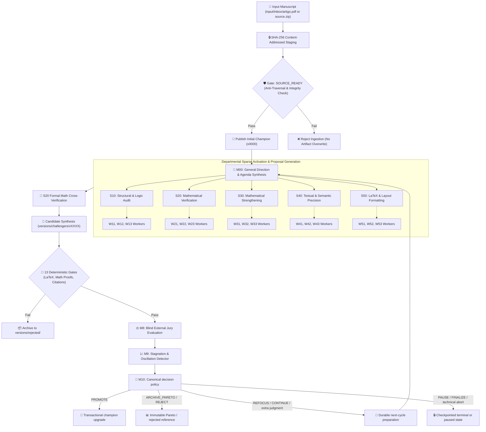

<div align="center">

# 🔬 LOOP-PRIMER
### Autonomous Multi-Agent Peer Review & Refinement Framework for Scientific & Mathematical Manuscripts

[](https://github.com/Walc21/LOOP-PRIMER/actions/workflows/ci.yml)
[](https://www.python.org/)
[](LICENSE)
[-purple.svg)](docs/architecture.md)
[](docs/architecture.md#catálogo-exato-de-21-papéis)
[](docs/decisions.md)

<p align="center">
  <b>A deterministic, auditable multi-agent review loop engineered for LaTeX and PDF scientific literature.</b>
</p>

</div>

> **Implementation status:** M0–M12 are implemented and locally validated;
> M12.5 adds deterministic, fail-closed inference routing and is validated
> locally plus on GitHub Actions with its real loopback HTTP fixture across
> Python 3.11–3.13. M12.5.1 Phase A wires selectable Prime/Routed execution
> per department back into the unchanged M6 receipts, with bounded authorized
> context, privacy modes, durable scientific outputs and an integer USD 10/run
> ceiling. Its code is offline-ready while configuration and live execution
> remain deliberately not ready. M10
> publishes a canonical, content-addressed `Decision`, revalidates it under a
> per-run lock, and applies its authorized disposition atomically. `FINALIZE`
> additionally requires immutable W22/W51/W53 attestations bound by SHA-256 to
> the candidate manifest, rendered PDF, and final report. M12 adds a durable,
> hash-bound budget ledger, conservative reconciliation, operational status and
> redacted structured logs; M12.5 adds write-once route decisions and inference
> receipts without changing M6 topology; M13 remains pending. M10 CLIs are operational; M11
> adds local commands and templates.
> They do not run an article, a model, or a paid API by themselves; the Prime
> Agent live smoke was not authorized or executed; the currently discovered
> binary does not by itself enable model execution.

---

## 📌 Table of Contents

- [Executive Summary](#-executive-summary)
- [Key Architectural Pillars](#-key-architectural-pillars)
- [System Pipeline Flow](#-system-pipeline-flow)
- [The 21-Agent Matrix](#-the-21-agent-matrix)
- [Deterministic Gates & Security](#-deterministic-gates--security)
- [Quick Start](#-quick-start)
- [CLI Reference](#-cli-reference)
- [Runbook](docs/runbook.md)
- [Repository Structure](#-repository-structure)
- [Architecture Decision Records (ADRs)](#-architecture-decision-records-adrs)
- [Contributing & License](#-contributing--license)

---

## 🔭 Executive Summary

**LOOP-PRIMER** is a contract-first, deterministic framework under incremental
implementation for auditable analysis, critique, mathematical verification and
iterative improvement of scientific papers. The scientific state machine is
implemented through M10; M11, M12, M12.5 and M12.5.1 add operational commands,
durable budgets/observability, inference routing and dual execution wiring
without changing its states.

Unlike conventional LLM wrappers, LOOP-PRIMER operates under **strict mathematical and architectural constraints**:
- **Air-gapped & Offline Verification**: No unauthenticated external network requests or speculative token generation during validation.
- **Content-Addressed Immutability**: Cryptographic SHA-256 fingerprinting for every manuscript version, diff, report, and decision.
- **Hierarchical Depth Boundary (Max Depth 2)**: Strict 21-agent hierarchy preventing uncontrolled recursion or authority escalation.
- **Blind External Jury**: Double-blind randomized evaluation with meta-reviewer consensus before candidate promotion.
- **Transactional Finalizer**: Atomic champion upgrades and Pareto frontier tracking with signed audit receipts.
- **Finalization Evidence Package**: W22/W51/W53 attestations bind the final
  candidate manifest, rendered PDF and final report before `FINALIZE`; crash
  recovery derives the same receipt instead of repeating an effect.

---

## 🏛 Key Architectural Pillars

```
+-----------------------------------------------------------------------------------+
|                                  LOOP-PRIMER                                      |
+-----------------------------------------------------------------------------------+
|  1. Ingestion & Invariants (SHA-256, Anti-Traversal, UTF-8 Normalization)         |
|  2. 21 Hierarchical Roles (General Direction -> 5 Departments -> 15 Workers)      |
|  3. Sparse Activation Engine (RUN, CHECK, SHIFT, FREEZE)                          |
|  4. 13 Deterministic Synthesis Gates (LaTeX Syntax, Theorem Proofs, BibTeX)      |
|  5. Blind External Jury & Meta-Review (Double-Blind Candidate Evaluation)         |
|  6. Stagnation Detection & Adaptive Refocusing (Plateau & Oscillation Analytics)  |
|  7. M10 Decision Policy, Pareto Evidence & Transactional Finalization             |
|  8. Transactional State Machine & Append-Only Event Chaining                      |
+-----------------------------------------------------------------------------------+
```

---

## 🔄 System Pipeline Flow



---

## 👥 The 21-Agent Matrix

LOOP-PRIMER establishes a strict 3-tier organizational hierarchy:

| ID | Role Name | Department | Depth | Focal Responsibility |
|:---|:---|:---|:---:|:---|
| **M00** | **General Director** | Direction | `0` | Strategic agenda, synthesis, gate verification, decision finalization |
| **S10** | **Lead Structural Auditor** | Structural/Auditing | `1` | Global logic, structural hierarchy, consistency audit |
| `W11` | Abstract & Introduction Worker | Structural/Auditing | `2` | Framing, thesis clarity, intro-to-conclusion alignment |
| `W12` | Logical Architecture Worker | Structural/Auditing | `2` | Argument flow, lemma dependency DAG, section transitions |
| `W13` | Contributions & Conclusion Worker | Structural/Auditing | `2` | Claim precision, future work bounds, conclusion integrity |
| **S20** | **Lead Math Verifier** | Math Verification | `1` | Formal rigor, theorem correctness, reproducibility consolidation |
| `W21` | Definitions & Hypotheses Worker | Math Verification | `2` | Axiomatic precision, notation consistency, hypothesis audit |
| `W22` | Theorems & Proofs Worker | Math Verification | `2` | Step-by-step deductive correctness, lemma soundness |
| `W23` | Computations & Reproducibility | Math Verification | `2` | Constant calculation, numerical examples, proof verification |
| **S30** | **Lead Math Strengthener** | Math Strengthening | `1` | Generalization and theorem strengthening consolidation |
| `W31` | Statements & Constants Worker | Math Strengthening | `2` | Tightening bounds, optimizing constants, statement sharpening |
| `W32` | Generalizations Worker | Math Strengthening | `2` | Extending proof domains, weakening preconditions |
| `W33` | Applications & Counterexamples | Math Strengthening | `2` | Instructive examples, edge cases, boundary checks |
| **S40** | **Lead Semantic Auditor** | Semantic Quality | `1` | Technical prose, linguistic clarity, academic cohesion |
| `W41` | Orthography & Grammar Worker | Semantic Quality | `2` | Syntax correctness, spelling, typographical standards |
| `W42` | Semantic Precision Worker | Semantic Quality | `2` | Eliminating ambiguity, sharpening technical vocabulary |
| `W43` | Academic Style & Cohesion | Semantic Quality | `2` | Tone harmonization, register consistency, academic cadence |
| **S50** | **Lead LaTeX & Layout** | Formatting/PDF | `1` | Compilation compliance, typographic beauty, PDF hygiene |
| `W51` | LaTeX & BibTeX Worker | Formatting/PDF | `2` | Macro hygiene, citation consistency, bibliography validation |
| `W52` | Equations & Visuals Worker | Formatting/PDF | `2` | Formula alignment, float placement, table/figure formatting |
| `W53` | PDF Compliance Worker | Formatting/PDF | `2` | PDF/A standard checks, font embedding, margin validation |

---

## 🔒 Deterministic Gates & Security

LOOP-PRIMER enforces security by construction:

1. **Gate Guardrails**: Missing or insufficient deterministic evidence fails closed. If OCR confidence or textual coverage is insufficient, execution halts with explicit issue diagnostics.
2. **Immutable Original Staging**: Manuscripts placed in `input/inbox/` are never overwritten in-place. Staging creates content-addressed read-only mirrors in `artifacts/original/<sha256>/`.
3. **Cryptographic Chaining**: Every state mutation records an event in `state/events/` referencing parent hashes.
4. **Offline Isolation**: Core synthesis and local contract tests require **zero** internet connectivity and **zero** paid API keys.

---

## 🚀 Quick Start

### 1. Prerequisites

- Linux (Ubuntu 22.04+, Debian 12+, Arch, etc.) or macOS
- Python 3.11+
- TeX Live & Poppler (`pdflatex`, `pdfinfo`, `pdftotext`) — required by the full regression suite and installed by `bin/bootstrap-deps.sh` on Debian/Ubuntu

### 2. Installation & Automated Bootstrap

```bash
# Clone the repository
git clone https://github.com/Walc21/LOOP-PRIMER.git
cd LOOP-PRIMER

# Automated system dependencies and virtual environment setup
bash bin/bootstrap-deps.sh
```

Or set up manually:

```bash
python3 -m venv .venv
source .venv/bin/activate
pip install -r requirements-dev.txt
```

### 3. Running Contract & Verification Tests

```bash
# Run core contract tests
.venv/bin/python -m unittest control.test_contracts

# Run AI context and handoff tests
.venv/bin/python -m unittest control.test_ai_handoff

# Run the complete M0-M12.5.1 regression suite
.venv/bin/python -m unittest discover -s control -p 'test_*.py' -q
```

### 4. Running Preflight Ingestion

Place your paper PDF in `input/inbox/artigo.pdf` and execute:

```bash
bash bin/preflight.sh
```

---

## 🧰 CLI Reference

LOOP-PRIMER provides modular, JSON-in / JSON-out CLI entrypoints:

- **`bin/preflight.sh`**: Ingestion, validation, and `SOURCE_READY` gate verifier.
- **`bin/check.sh`**: Fast local M11/M12/M12.5/M12.5.1 surface, monetary ceiling and fail-closed readiness check.
- **`bin/start-prime.sh`**: Dry-run-by-default launcher; live mode requires
  explicit authorization, budget/configuration, preflight, STOP clearance and
  a discovered Prime Agent binary.
- **`scripts/article_loop_command.py`**: Thin JSON-in / JSON-out bridge for
  the existing bootstrap, preflight, cycle, status, checkpoint, pause, resume,
  stop and finalization APIs. See [`docs/runbook.md`](docs/runbook.md).
- **`scripts/01_external_evaluator.py`**: Double-blind jury evaluator CLI (Milestone 8).
- **`scripts/02_stagnation_detector.py`**: Plateau, oscillation, and diagnostic detector (Milestone 9).
- **`scripts/03_refocus_generator.py`**: Adaptive prompt and parameter refocusing generator (Milestone 9).
- **`scripts/04_compensation_policy.py`**: Revalidates M7–M9 evidence and
  publishes one immutable M10 `Decision`; accepts `--root`, `--run-id`,
  `--cycle-id` or the equivalent bounded JSON input.
- **`scripts/05_transactional_finalizer.py`**: Revalidates the published
  `Decision`, candidate and evidence package under a per-run lock, then records
  the atomic disposition and immutable receipt. A retry after a receipt-only
  crash records only the pending event/checkpoint.
- **`scripts/ai_context.py`**: Deterministic content-addressed session context snapshot generator.
- **`scripts/ai_history.py`**: Session ledger and ADR history updater.

---

## 📂 Repository Structure

```text
LOOP-PRIMER/
├── .github/                      # GitHub Actions CI & community templates
│   ├── workflows/ci.yml          # Multi-Python version test suite
│   ├── copilot-instructions.md   # GitHub Copilot entrypoint
│   ├── pull_request_template.md  # PR checklist and verification template
│   └── ISSUE_TEMPLATE/           # Bug report & feature request schemas
├── .prime/                       # Prime Agent integration layer & skills
│   └── agent/skills/article-loop/src/article_loop/ # Core framework, including M10 policy/finalizer
├── bin/                          # Shell entrypoints (bootstrap, preflight, check, Prime launcher)
├── config/                       # Declarative budgets, gates, roles, policy, and JSON schemas
│   ├── roles/                    # 21 YAML definitions for M00, S10-S50, W11-W53
│   ├── rubrics/                  # Evaluation rubrics for blind jury
│   └── schemas/                  # JSON Schema definitions for strict validation
├── control/                      # Contract and milestone test suites (M1 through M12.5.1)
├── docs/                         # Architecture, ADRs, compatibility, and AI history
│   ├── architecture.md           # Canonical system architecture
│   ├── decisions.md              # Architectural Decision Records (ADRs)
│   ├── runbook.md                # Local M11/M12/M12.5.1 operation and recovery guide
│   └── AI_HISTORY.md             # Chronological ledger of system evolution
├── prompts/                      # Immutable system prompts and role overlays
├── scripts/                      # Independent, deterministically tested CLI modules
├── artifacts/                    # Content-addressed input & extracted cache (gitignored)
├── state/                        # Append-only durable event logs & locks (gitignored)
├── versions/                     # Champion, challenger, Pareto & rejected versions
├── requirements-dev.txt          # Pinned development dependencies
├── AGENTS.md                     # Canonical policy for AI coding agents
├── CLAUDE.md                     # Claude adapter to AGENTS.md
├── GEMINI.md                     # Gemini adapter to AGENTS.md
├── AI_CONTEXT.md                 # Portable generated context for AI sessions
├── LICENSE                       # MIT License
├── CONTRIBUTING.md               # Contribution guidelines & commit convention
└── SECURITY.md                   # Security and sandboxing policy
```

---

## 📜 Architecture Decision Records (ADRs)

All core design choices are formally recorded in [`docs/decisions.md`](docs/decisions.md):

| ADR | Title | Status | Scope |
|:---|:---|:---:|:---|
| **ADR-001** | Content-Addressed Preservation & Single Entrypoint | `Accepted` | Ingestion |
| **ADR-002** | 21-Role Canonical Catalog & RLM Depth $\le 2$ | `Accepted` | Organization |
| **ADR-003** | Sparse Activation Matrix (`RUN`/`CHECK`/`SHIFT`/`FREEZE`) | `Accepted` | Resource Control |
| **ADR-008** | Append-Only Event Log & Hash Chaining | `Accepted` | State Storage |
| **ADR-013** | 13 Deterministic Synthesis Gates | `Accepted` | Verification |
| **ADR-021** | Double-Blind Jury & Randomized Presentation | `Accepted` | Evaluation |
| **ADR-024** | Plateau & Oscillation Diagnostic Engine | `Accepted` | Adaptability |
| **ADR-028** | Pure Decision Policy & Transactional Finalization | `Accepted` | M10 disposition |
| **ADR-029** | Final Evidence Package & Phase-Covered Recovery | `Accepted` | M10.1 hardening |
| **ADR-030** | Local Commands & Fail-Closed Prime Integration | `Accepted` | M11 operations |
| **ADR-031** | Durable Budget & Fail-Closed Observability | `Accepted` | M12 operations |
| **ADR-032** | Deterministic Inference Routing & Durable Receipts | `Accepted` | M12.5 inference |
| **ADR-033** | Dual End-to-End Execution Wiring | `Accepted` | M12.5.1 Phase A |
| **ADR-026** | Content-Addressed AI Handoff & Session Ledger | `Accepted` | AI Protocol |
| **ADR-027** | Audience Separation & Publishable Git History | `Accepted` | Repository Integration |

---

## 🤝 Contributing & License

Contributions are welcome! Please review [`CONTRIBUTING.md`](CONTRIBUTING.md) and [`SECURITY.md`](SECURITY.md) before opening pull requests.

Distributed under the **MIT License**. See [`LICENSE`](LICENSE) for complete details.

**Author**: Victor Gabriel de Oliveira ([@Walc21](https://github.com/Walc21))
